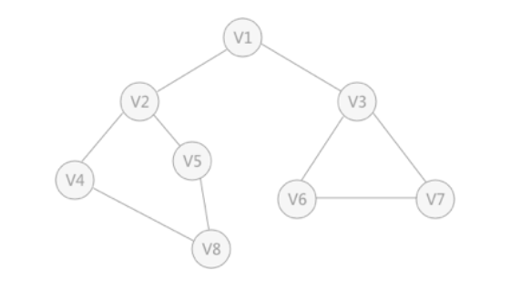

# 遍历

## 图的创建

```shell
gcc main.c -o main
./main
创建图
请输入顶点和弧的数目: 8 9
请输入顶点元素的值：1 2 3 4 5 6 7 8  
请输入有关联边的两点: 1 2
2 4
2 5
4 8
5 8
1 3
3 6
6 7
7 3
********************
***1.深度优先遍历***
***2.广度优先遍历***
*****0.退出程序*****
********************
```

通过以上操作生成了这样的一张图



## 程序运行结果

### 1.深度优先遍历

```shell
深度优先遍历为:
1 2 4 8 5 3 6 7
********************
***1.深度优先遍历***
***2.广度优先遍历***
*****0.退出程序*****
********************
```

### 2.广度优先遍历

```shell
广度优先遍历为:
1 2 3 4 5 6 7 8
********************
***1.深度优先遍历***
***2.广度优先遍历***
*****0.退出程序*****
********************
```
